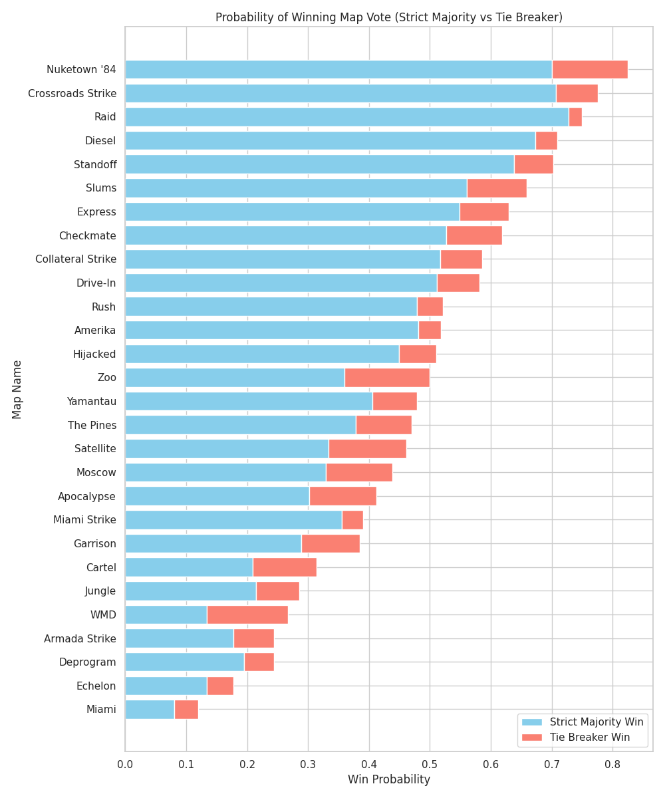
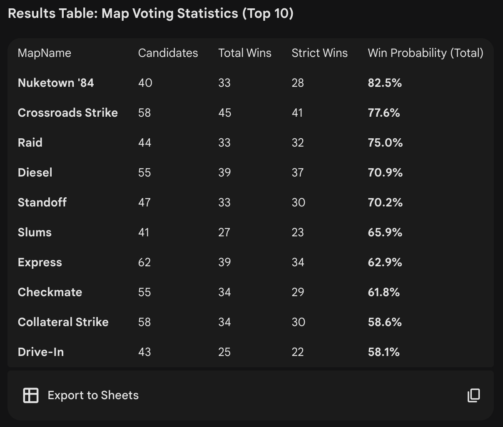

```{r setup, include=FALSE}
knitr::opts_chunk$set(echo = TRUE)
```

## Front Matter

```{r}
rm(list=ls())

# Libraries
library(tidyverse)
library(kableExtra)

# Dataset Read-in
CODModes <- read.csv("Raw Data/CODGameModes.csv")
CODGamesP1 <- read.csv("Raw Data/CODGames_p1_380.csv")
CODGamesP2 <- read.csv("Raw Data/CODGames_p2_380.csv")
CODMaps <- read.csv("Raw Data/CODMaps.csv")
```

## Quick Dataset Checking

### Modes Dataset

```{r}
str(CODModes)
```

### Player 1 Games Dataset

```{r}
str(CODGamesP1)
```

### Player 2 Games Dataset

```{r}
str(CODGamesP2)
```

### Maps Dataset

```{r}
str(CODMaps)
```
Looking through the data overviews, I do not see any concerns.

## Combining Player Data

Looking at both the Player 1 and Player 2 datasets, it seems that they have the same column names so I will just add a row denoting player 1 or player 2 and perform a row bind.

```{r}
CODGamesAllPlayers <- 
  rbind(CODGamesP1 %>% mutate(playerNum = 1),
        CODGamesP2 %>% mutate(playerNum = 2))
```

### Checking Dataset

```{r}
str(CODGamesAllPlayers)
```

Looking at the dataset overview, I see no concerns as 839 observations = 589 obs. (from player 1) + 250 obs.(from player 2).

## Task #1

The research question for this task is: Which maps are the most likely to win the map vote when they are an option?

According to the relevant information part of the instruction guide, players are given two choices represented in the `Map1` and `Map2` variables. There also is a `MapVote` variable which shows the voting tally and can also serve as a filter of that which there are no player votes. The winning map vote is then placed in the `Choice` variable. Also according to the problem guidance, there is data quality issues. Focusing on the variables above, the first step I must take is to fix the data quality issues. To address this I will first look at if there are missing values in any of these columns and likely remove them. Then I shall at each of the unique data observations to see if there is spelling issues. I will validate this by looking at the differences between the CODMaps Names that are apparently all correct. Note: I do recognize that we: "should consider whether a given map won the vote by getting more votes than the other option or if it was selected since it was `Map1` and the vote was a tie." It is evident from the research question that we need to consider maps that win the map vote. If a map did not win as a result of a map vote, that is not considered a win by our research question and therefore all blank entries as well as ties must be denoted as losses. That can be done by making an indicator variable of tie or not tie. That should alleviate data quality concerns hopefully. The second step would then be to use the hint given in the document to make a: "table in your report showing the name of the map, the number of times it was a candidate, the number of times it won the vote, and the proportion/probability." The number of times a map appears as a candidate and number of times it won are simply a matter of making the data into a 0 or 1, or True or False thing of is it a map name and then simply summing across respective column. As such, the answer to the research question should be based on that proportion/probability of how many times a map won its vote. The most likely is a subjective number where I will simply present a table of the proportions from largest to smallest where the viewer can be like I consider this many to be the most likely number of maps.

### Data Cleaning

First I will check if there is NA's

```{r}
sum(is.na(CODGamesAllPlayers$Map1))
sum(is.na(CODGamesAllPlayers$Map2))
sum(is.na(CODGamesAllPlayers$MapVote))
sum(is.na(CODGamesAllPlayers$Choice))
```

There are no NA's in the data

Next I will check the differences between the map names in these categories with the correct ones from the COD MAPS dataset.

```{r}
setdiff(CODGamesAllPlayers$Map1, CODMaps$Name)
setdiff(CODGamesAllPlayers$Map2, CODMaps$Name)
setdiff(CODGamesAllPlayers$Choice, CODMaps$Name)
```

Looking like there are "" instead of NAs. I will manually correct the all of those wrong names.

Correct Map Names are as follows

```{r}
data.frame(Names = CODMaps$Name) %>%
  arrange(Names) %>%
  kable()
```

#### Manual Correction

NOTE I WILL CLEAN AND NAME THE DATASET `CODGamesAllPlayersCleaned`!

##### Map1 Variable

Differences are:

```{r}
setdiff(CODGamesAllPlayers$Map1, CODMaps$Name)
```

Using my best guess of what they are:

```{r}
CODGamesAllPlayersCleaned <- CODGamesAllPlayers %>%
  filter(Map1 != "")

CODGamesAllPlayersCleaned$Map1[CODGamesAllPlayersCleaned$Map1 == "Jungle "] <- "Jungle"
CODGamesAllPlayersCleaned$Map1[CODGamesAllPlayersCleaned$Map1 == "Ruah"] <- "Rush"
CODGamesAllPlayersCleaned$Map1[CODGamesAllPlayersCleaned$Map1 == "Collateral"] <- "Collateral Strike"
CODGamesAllPlayersCleaned$Map1[CODGamesAllPlayersCleaned$Map1 == "Riad"] <- "Raid"
CODGamesAllPlayersCleaned$Map1[CODGamesAllPlayersCleaned$Map1 == "Miami "] <- "Miami"
CODGamesAllPlayersCleaned$Map1[CODGamesAllPlayersCleaned$Map1 == "Collateral Striek"] <- "Collateral Strike"
CODGamesAllPlayersCleaned$Map1[CODGamesAllPlayersCleaned$Map1 == "Miami Stirke"] <- "Miami Strike"
CODGamesAllPlayersCleaned$Map1[CODGamesAllPlayersCleaned$Map1 == "Collaterol Strike"] <- "Collateral Strike"
CODGamesAllPlayersCleaned$Map1[CODGamesAllPlayersCleaned$Map1 == "Drive-in"] <- "Drive-In"
CODGamesAllPlayersCleaned$Map1[CODGamesAllPlayersCleaned$Map1 == "Deprogam"] <- "Deprogram"
CODGamesAllPlayersCleaned$Map1[CODGamesAllPlayersCleaned$Map1 == "Rush "] <- "Rush"
CODGamesAllPlayersCleaned$Map1[CODGamesAllPlayersCleaned$Map1 == "Zoo "] <- "Zoo"
CODGamesAllPlayersCleaned$Map1[CODGamesAllPlayersCleaned$Map1 == "Raid "] <- "Raid"
```

Checking if I got all of them

```{r}
setdiff(CODGamesAllPlayersCleaned$Map1, CODMaps$Name)
```

Yay!

##### Map2 Variable

Differences are:

```{r}
setdiff(CODGamesAllPlayersCleaned$Map2, CODMaps$Name)
```

Using my best guess of what they are:

```{r}
CODGamesAllPlayersCleaned$Map2[CODGamesAllPlayersCleaned$Map2 == "Miami Stirke"] <- "Miami Strike"
CODGamesAllPlayersCleaned$Map2[CODGamesAllPlayersCleaned$Map2 == "Collateral"] <- "Collateral Strike"
CODGamesAllPlayersCleaned$Map2[CODGamesAllPlayersCleaned$Map2 == "yamantau"] <- "Yamantau"
CODGamesAllPlayersCleaned$Map2[CODGamesAllPlayersCleaned$Map2 == "Drive-in"] <- "Drive-In"
CODGamesAllPlayersCleaned$Map2[CODGamesAllPlayersCleaned$Map2 == "Nuketown '84 Halloween"] <- "Nuketown '84"
CODGamesAllPlayersCleaned$Map2[CODGamesAllPlayersCleaned$Map2 == "Miami Sstrike"] <- "Miami Strike"
CODGamesAllPlayersCleaned$Map2[CODGamesAllPlayersCleaned$Map2 == "Amrada Strike"] <- "Armada Strike"
```

Checking if I got all of them

```{r}
setdiff(CODGamesAllPlayersCleaned$Map2, CODMaps$Name)
```

Yay!

##### Choice Variable

Differences are:

```{r}
setdiff(CODGamesAllPlayersCleaned$Choice, CODMaps$Name)
```

Using my best guess of what they are:

```{r}
CODGamesAllPlayersCleaned$Choice[CODGamesAllPlayersCleaned$Choice == "Apocolypse"] <- "Apocalypse"
CODGamesAllPlayersCleaned$Choice[CODGamesAllPlayersCleaned$Choice == "Collateral"] <- "Collateral Strike"
CODGamesAllPlayersCleaned$Choice[CODGamesAllPlayersCleaned$Choice == "APocalypse"] <- "Apocalypse"
CODGamesAllPlayersCleaned$Choice[CODGamesAllPlayersCleaned$Choice == "Drive-in"] <- "Drive-In"
CODGamesAllPlayersCleaned$Choice[CODGamesAllPlayersCleaned$Choice == "Collaterel Strike"] <- "Collateral Strike"
CODGamesAllPlayersCleaned$Choice[CODGamesAllPlayersCleaned$Choice == "Nuketown '84 Halloween"] <- "Nuketown '84"
CODGamesAllPlayersCleaned$Choice[CODGamesAllPlayersCleaned$Choice == "Deisel"] <- "Diesel"
```

Checking if I got all of them

```{r}
setdiff(CODGamesAllPlayersCleaned$Choice, CODMaps$Name)
```

Yay!

#### Remove Ties & No Votes

First checking the unique values if there are any NAs or "".

```{r}
unique(CODGamesAllPlayersCleaned$MapVote)
```

There does not seem to be any missing votes here so I can proceed to removing Ties, however, I do see that in some of them there is an inconsistent delimiter. I can see a pattern though that there is only single digit votes and therefore the numbers I need are the first character and the last character.

I realistically do not care who wins the vote and only care if the first and last numbers are the same. So there is no need to store the numbers and I will just do a comparison in an ifelse and set the indicator based on that (`tieIndicator` = 1 if tie, 0 otherwise). I have no clue how to get the first and last characters of a string in R because in python it would be intuitive as a string is an iterable and I could index at 0 and -1 but for whatever reason R is not the same :(. I therefore searched how do I get the first and last letter of a string in r on google and got the str_sub function from tidyverse as the solution.

```{r}
CODGamesAllPlayersCleaned <-
  CODGamesAllPlayersCleaned %>%
  mutate(
    tieIndicator = ifelse(
      str_sub(CODGamesAllPlayersCleaned$MapVote, 1, 1) != str_sub(CODGamesAllPlayersCleaned$MapVote, -1, -1),
      0,
      1)
    )
```

Checking if it worked

```{r}
CODGamesAllPlayersCleaned %>%
  select(MapVote, tieIndicator) %>%
  head(10) %>%
  kable()
```

It worked, yay!

That should hopefully conclude the data cleaning part.

### Table of Map Candidacy and Chosen Rate

First I need to identify the number of times a map is a candidate. This can probably be done through a summarize on `Map1` and `Map2` then joining those tables and once again summarize.

```{r}
CandicacyMap <- full_join(
  CODGamesAllPlayersCleaned %>% group_by(Map1) %>% summarize(n = n()),
  CODGamesAllPlayersCleaned %>% group_by(Map2) %>% summarize(n = n()),
  by = join_by(Map1 == Map2))

CandicacyMap %>% kable()
```

All 28 maps are accounted for yay! Now I just need to sum the numbers for total candidacy.

```{r}
CandicacyMap <- 
  CandicacyMap %>%
  mutate(TotalCandidacies = n.x + n.y) %>%
  select(Map1, TotalCandidacies) %>%
  rename(MapName = Map1)

CandicacyMap %>% kable()
```

Now I need to get the number of times a map won from `Choice` and is not a tie from `tieIndicator`. This is also probably through summarize but I'll just directly join it.

```{r}
CandicacyMap <- 
  full_join(
    CandicacyMap,
    CODGamesAllPlayersCleaned %>% filter(tieIndicator == 0) %>% group_by(Choice) %>% summarize(NumberOfSelections = n()),
    by = join_by(MapName == Choice)
  )

CandicacyMap %>% kable()
```

Yay!

The last thing to do here is make the proportions (selections divided by candidacies) and then sort them. I'm also gonna change the order of selections and candidacies to make the table look more intuitive.

```{r}
CandicacyMap <- 
  CandicacyMap %>%
  mutate(ProportionOfSelection = round(NumberOfSelections / TotalCandidacies, 4)) %>%
  arrange(desc(ProportionOfSelection)) %>%
  select(MapName, NumberOfSelections, TotalCandidacies, ProportionOfSelection)

CandicacyMap %>% kable()
```

The last step here is to make a visualization of this information on the `ProportionOfSelection`. Since we are looking at the spread of categorical data, I am just going to use a barplot.

```{r}
# For the axis labels layer, I took that line from my (Ishan) Mini-Project 1
ggplot(CandicacyMap, aes(MapName, ProportionOfSelection)) +
  geom_col(color = "black", fill = "forestgreen") +
  theme(axis.text.x = element_text(angle = 45, vjust = 1, hjust=1)) + # Note this line was taken from: https://www.statology.org/rotate-axis-labels-ggplot2/
  xlab("Map Name") +
  ylab("Proportion of Times Winning Map Vote") +
  ggtitle("Proportion a Map wins a Map Vote when an Option")
```

### Research Question Answer

Looking mostly at the table since it is easier to look through since it is cleanly arranged, it looks like `Nuketown ’84` is the most likely to be picked, followed by `Raid`, followed by `Crossroads Strike`, continue this train of thought till you reach your desired however many is the likely number you would like.

## Task #2

For this question I used the AI model of Gemini 3.0

You may find the exact prompt and reponses from Gemini at the following link: <https://gemini.google.com/share/7c470706e207>

### Prompts

The first prompt that I gave R was as follows:

NOTE: I also provided Gemini with the csv files of CODGames_p1_380.csv, CODGames_p2_380.csv, and CODMaps.csv

```
Consider the following


Relevant Information: Prior to each online match, players in the game lobby are presented with two options for the battlefield of the upcoming game (`Map1` and `Map2`). The players have the option to vote, and the resulting vote is recorded in the `MapVote` column. The winning map is listed in the `Choice` column. In the event of a tie vote, the map listed in `Map1` is chosen. (Games for which the player entered the lobby after the vote has taken place have no information in `Map1` and `Map2` but have the winning map presented in `Choice`.) Research Question: Which maps are the most likely to win the map vote when they are an option? Notes: To answer this question, write a paragraph (or more) discussing how you plan to answer this question. Be sure to address the data quality issues mentioned below and discuss how you will do the calculations. Then, write code and answer the question. (If I must answer questions about your approach/decision making process by reading your code rather than your discussion, you will lose points.) As part of your solution, you should calculate the proportion/probability that a map wins the vote given that it was a candidate. To do this, you will have to calculate the number times that each map was listed as a candidate (Map1 or Map2) and earned more votes than the other candidate. As part of this, you should consider whether a given map won the vote by getting more votes than the other option or if it was selected since it was `Map1` and the vote was a tie. You should include a table in your report showing the name of the map, the number of times it was a candidate, the number of times it won the vote, and the proportion/probability. You should also include a visualization of the results. Then, write a clear answer to the research question. There might be some data quality issues (such as misspelled map names and extra (trailing) blanks in some entries) to solve for this problem. You can find the proper names/spellings in the CODMaps.csv file. To full receive full credit, you must write code to solve these issues rather than editing the .csv files.


Also find the attached csv files that are explained below:

1. CODGames_p1_380.csv contains information about the results of an online, first-person shooter video game. (Games such as Call of Duty, Fortnite, Apex Legends, Battlefield has been immensely popular in the last 5 years.) The dataset contains information about a single player, who we will call Player 1. In the game, the player is part of a team trying to win an online match against other online competitors. Points are earned for various tasks such as eliminating enemy combatants, collecting items, capturing a location, etc. Each row represents the results of a single, randomly selected, online match in which Player 1 participated. o NOTE: When reading in this dataset, make sure the variables names are Map1, Map2, Choice, etc. instead of V1, V2, … o We have seen this issue before. To solve it, click the box for Yes for Heading in the Import Dataset interface. o This is not the same dataset used in the mini-projects and may require additional cleaning.


2. CODGames_p2_380.csv is similar to CODGames_p1.csv but is for a different player, who we will call Player 2. o You will want to combine the information in this dataset with the information in CODGames_p1_380.csv into one dataset.


3. CODMaps.csv contains information about the various maps available in the game. The dataset contains 3 variables: o Name – The name of the map/battleground o FirstAvailable – The event during which the map become available (Launch, Season 1, Season 2, etc.) o Date – The date on which the map become available


Solve the Research Question: Which maps are the most likely to win the map vote when they are an option?
```

Note that the model responded in python, a language I am adept in and understand, but I realize that it is not really the intention of this class so I tried to get Gemini to turn it into R code. It does seem that Gemini converted the code to R, but it could not run it and I am hence stuck with the python run.

In attempt to do this I gave Gemini the following prompts of

```
Please provide the code in R
```

and

```
Provide the visualization as well in R
```

### Results

#### Gemini gives the following plan and approach

Plan and Approach

To answer the research question regarding which maps are most likely to win a vote, I first combined the game data from both players (CODGames_p1_380.csv and CODGames_p2_380.csv) into a single dataset. A significant challenge in this analysis was data quality; specifically, the map names contained numerous spelling errors and inconsistencies (e.g., "Ruah" for "Rush", "Collateral Striek" for "Collateral Strike", and trailing whitespace like "Jungle "). I addressed this by cleaning the map names in the game data, using the CODMaps.csv file as a reference for correct spellings and mapping identified typos to their canonical names.

For the calculations, I defined a map as a "candidate" if it appeared in either the Map1 or Map2 columns. To determine the win probability, I analyzed the MapVote and Choice columns. I discovered that the MapVote column consistently formats votes as "Winner's Vote count to Loser's Vote count" (e.g., "5 to 0" always, never "0 to 5"). Using this, I calculated two metrics:

Strict Wins: The number of times a map earned a strict majority of votes (Vote_Winner > Vote_Loser).

Total Wins: The number of times a map was the final Choice, which includes both strict majorities and instances where the map won via the tie-breaker rule (where Map1 wins if votes are equal). The final probability presented is the Total Win Rate (Total Wins / Candidacies), as this represents the true likelihood of a map being played, but the analysis effectively distinguishes between popularity (strict votes) and systemic advantage (tie-breakers).

```{python eval = FALSE}
import pandas as pd
import matplotlib.pyplot as plt
import seaborn as sns

# Load datasets
df1 = pd.read_csv('CODGames_p1_380.csv')
df2 = pd.read_csv('CODGames_p2_380.csv')
cod_maps = pd.read_csv('CODMaps.csv')

# Combine game data
combined_df = pd.concat([df1, df2], ignore_index=True)

# Standardize Map Names
clean_map_names = set(cod_maps['Name'].str.strip().unique())

def clean_name(name):
    if pd.isna(name):
        return name
    name = str(name).strip()
    
    # Correction dictionary for identified typos
    corrections = {
        'Ruah': 'Rush', 'Riad': 'Raid', 'Raid ': 'Raid',
        'Collateral Striek': 'Collateral Strike', 'Collaterol Strike': 'Collateral Strike',
        'Collaterel Strike': 'Collateral Strike', 'Collateral': 'Collateral Strike',
        'Deisel': 'Diesel', 'Deprogam': 'Deprogram',
        'Apocolypse': 'Apocalypse', 'APocalypse': 'Apocalypse',
        'yamantau': 'Yamantau', 'Miami Stirke': 'Miami Strike',
        'Miami Sstrike': 'Miami Strike', 'Amrada Strike': 'Armada Strike',
        'Drive-in': 'Drive-In', "Nuketown '84 Halloween": "Nuketown '84",
        'Jungle ': 'Jungle', 'Rush ': 'Rush', 'Zoo ': 'Zoo', 'Miami ': 'Miami'
    }
    
    if name in corrections:
        return corrections[name]
    
    # Case insensitive match
    for valid in clean_map_names:
        if name.lower() == valid.lower():
            return valid
    return name

# Apply cleaning
combined_df['Map1'] = combined_df['Map1'].apply(clean_name)
combined_df['Map2'] = combined_df['Map2'].apply(clean_name)
combined_df['Choice'] = combined_df['Choice'].apply(clean_name)

# Filter for valid voting scenarios
vote_df = combined_df.dropna(subset=['Map1', 'Map2']).copy()

# Parse MapVote: Data inspection revealed format is "WinnerVotes to LoserVotes"
def parse_votes(vote_str):
    try:
        parts = str(vote_str).lower().split(' to ')
        return int(parts[0]), int(parts[1])
    except:
        return 0, 0

vote_df[['Vote1', 'Vote2']] = vote_df['MapVote'].apply(lambda x: pd.Series(parse_votes(x)))

# Calculate Statistics
unique_candidates = pd.unique(vote_df[['Map1', 'Map2']].values.ravel('K'))
map_stats = {}

for map_name in unique_candidates:
    # Candidacy Count
    candidates = vote_df[(vote_df['Map1'] == map_name) | (vote_df['Map2'] == map_name)]
    candidate_count = len(candidates)
    
    if candidate_count == 0:
        continue
        
    # Wins (Official Choice)
    wins_df = candidates[candidates['Choice'] == map_name]
    total_wins = len(wins_df)
    
    # Strict Wins (Winner Votes > Loser Votes)
    # Since Vote1 is always >= Vote2, a strict win is simply when Vote1 != Vote2
    strict_wins = len(wins_df[wins_df['Vote1'] > wins_df['Vote2']])
    
    map_stats[map_name] = {
        'Candidates': candidate_count,
        'Total_Wins': total_wins,
        'Strict_Wins': strict_wins,
        'Win_Rate': total_wins / candidate_count
    }

# Create DataFrame
final_stats = pd.DataFrame.from_dict(map_stats, orient='index')
final_stats = final_stats.sort_values('Win_Rate', ascending=False)
final_stats.index.name = 'MapName'
final_stats = final_stats.reset_index()

# Visualization
sns.set(style="whitegrid")
plt.figure(figsize=(10, 8))
plot_data = final_stats.copy().sort_values('Win_Rate', ascending=True)
plot_data['Tie_Win_Rate'] = plot_data['Win_Rate'] - (plot_data['Strict_Wins'] / plot_data['Candidates'])
plot_data['Strict_Win_Rate_Calc'] = plot_data['Strict_Wins'] / plot_data['Candidates']

p1 = plt.barh(plot_data['MapName'], plot_data['Strict_Win_Rate_Calc'], color='skyblue', label='Strict Majority Win')
p2 = plt.barh(plot_data['MapName'], plot_data['Tie_Win_Rate'], left=plot_data['Strict_Win_Rate_Calc'], color='salmon', label='Tie Breaker Win')

plt.xlabel('Win Probability')
plt.ylabel('Map Name')
plt.title('Probability of Winning Map Vote')
plt.legend()
plt.tight_layout()
plt.savefig('map_vote_probability.png')
```

Answer to Research Question

Based on the analysis of the voting data, Nuketown '84 is the map most likely to win the map vote, winning 82.5% of the time it is presented as a candidate. It is followed by Crossroads Strike (77.6%) and Raid (75.0%).

It is worth noting that Nuketown '84 benefits significantly from the tie-breaker rule; while it has a strict majority win rate of 70%, its total win rate jumps to 82.5% because it wins tied votes when it appears as Map1. In contrast, maps like Crossroads Strike rely almost entirely on strict popularity (majority votes) for their wins. The least likely maps to win are Miami (12.0%) and Echelon (17.8%).

#### Interpretation of Python Version

The code seems to do data cleaning in fixing the map names. The cleaning names do look familiar to me so that part looks right.

The code then seems to "Parse MapVote" for trying to find voting tallys like I did. The AI gave the interpretation that: Data inspection revealed format is "WinnerVotes to LoserVotes". THIS IS WRONG. As I noted in my part, I found that the delimiter was inconsistent with WinnerVotes to LoserVotes sometimes dropping the t in 'to'. The way they got around this way by thinking that anything that didn't follow that pattern is just an invalid entry and hence should be treated like 0 to 0, which is WRONG and is going to give some wrong proportions.

Gemini then calculated the statistics quite like how I did in my approach where they found unique map names and summed them.

Gemini then came up with the following visualizations:





My results from Task 1 are:

```{r}
CandicacyMap %>% kable()
```

Comparing the tables, the proportions are simply incorrect since according to the research question we need proportions to represent when they win a vote, where the Gemini table is including when it ties (which is WRONG as it is not conforming to the research question and they should be displaying and ranking by strict wins / candidates).

Note that as I identified above, the delimiter is different for some entries. One thing that is similar across both our results are the number of strict wins and total candidacies, take Nuketown where we both found 28 strict wins 40 selections, or crossroads where we both found 41 strict wins and 58 candidacies. To see if I can identify which are those which should cause problems I will try to find the rows and compare the map names in Gemini and my tables.

```{r}
unique(CODGamesAllPlayersCleaned$MapVote)
```

The inconsistent delimiters are "4 o 0" and "2 o 0", which are clearly not tie votes as Gemini would count them.

Now to check the rows for these

```{r}
CODGamesAllPlayersCleaned %>%
  select(Map1, Map2, Choice, MapVote) %>%
  filter(MapVote == "4 o 0" | MapVote == "2 o 0") %>%
  kable()
```

It seems there is only one misspelling per each of those options hence I shall directly look for Diesel and Garrison to see if they have one less win because they consider it those battles a tie when they in fact not.

Unfortunately Garrison is not in the top ten table provided by Gemini, BUT Diesel is present. As can be seen in the table, Gemini says Diesel has 37 strict wins, while my table has Diesel with 38 wins. Indicating that the delimiter issue I brought up is a validated concern.

### Interpretation of R Version

For this classes purposes, I had Gemini turn the python code into R code. Note Gemini could not run the code but it apparently mirrors the python code.

```{r}
# 1. Load Data
df1 <- read_csv("Raw Data/CODGames_p1_380.csv", show_col_types = FALSE) # I CHANGED FILE PATHS
df2 <- read_csv("Raw Data/CODGames_p2_380.csv", show_col_types = FALSE)
maps_ref <- read_csv("Raw Data/CODMaps.csv", show_col_types = FALSE)

# Combine datasets
combined_df <- bind_rows(df1, df2)

# 2. Data Cleaning
# Define a function to clean map names using standard dplyr approaches
clean_map_name <- function(name) {
  name <- str_trim(name) # Remove trailing/leading whitespace
  
  case_when(
    # Fix known typos
    name == "Ruah" ~ "Rush",
    name == "Riad" | name == "Raid " ~ "Raid",
    name %in% c("Collateral Striek", "Collaterol Strike", "Collaterel Strike", "Collateral") ~ "Collateral Strike",
    name == "Deisel" ~ "Diesel",
    name == "Deprogam" ~ "Deprogram",
    name %in% c("Apocolypse", "APocalypse") ~ "Apocalypse",
    name == "yamantau" ~ "Yamantau",
    name %in% c("Miami Stirke", "Miami Sstrike") ~ "Miami Strike",
    name == "Amrada Strike" ~ "Armada Strike",
    name == "Drive-in" ~ "Drive-In",
    name == "Nuketown '84 Halloween" ~ "Nuketown '84",
    # Default: keep original name if no correction needed
    TRUE ~ name
  )
}

# Apply cleaning to relevant columns
clean_df <- combined_df %>%
  mutate(
    Map1 = clean_map_name(Map1),
    Map2 = clean_map_name(Map2),
    Choice = clean_map_name(Choice)
  ) %>%
  # Filter to rows where a vote actually occurred (Map1 and Map2 are not NA)
  filter(!is.na(Map1) & !is.na(Map2))

# 3. Calculations
# First, calculate how many times each map was a candidate
candidates_count <- clean_df %>%
  select(Map1, Map2) %>%
  pivot_longer(cols = everything(), values_to = "MapName") %>%
  count(MapName, name = "Candidates")

# Next, calculate how many times each map won (was the Choice)
wins_count <- clean_df %>%
  count(Choice, name = "Total_Wins") %>%
  rename(MapName = Choice)

# Optional: Calculate Strict Wins vs Tie Wins for deeper analysis
# Parse the MapVote column "X to Y"
vote_analysis <- clean_df %>%
  separate(MapVote, into = c("Vote_Win", "Vote_Loss"), sep = " to ", convert = TRUE) %>%
  mutate(
    # A strict win is when the votes are not equal
    Is_Strict_Win = Vote_Win > Vote_Loss,
    # A tie win is when votes are equal (Winner determined by Map1 position)
    Is_Tie_Win = Vote_Win == Vote_Loss
  ) %>%
  group_by(Choice) %>%
  summarise(
    Strict_Wins = sum(Is_Strict_Win, na.rm = TRUE),
    Tie_Wins = sum(Is_Tie_Win, na.rm = TRUE)
  ) %>%
  rename(MapName = Choice)

# Merge all statistics
final_stats <- candidates_count %>%
  left_join(wins_count, by = "MapName") %>%
  left_join(vote_analysis, by = "MapName") %>%
  replace_na(list(Total_Wins = 0, Strict_Wins = 0, Tie_Wins = 0)) %>%
  mutate(
    Probability = Total_Wins / Candidates,
    Strict_Prob = Strict_Wins / Candidates
  ) %>%
  arrange(desc(Probability))

# 4. Display Table
print(as.data.frame(final_stats))

# 5. Visualization
ggplot(final_stats, aes(x = reorder(MapName, Probability), y = Probability)) +
  geom_bar(stat = "identity", fill = "steelblue") +
  coord_flip() +
  labs(
    title = "Probability of Winning Map Vote",
    x = "Map Name",
    y = "Probability (Win Rate)"
  ) +
  theme_minimal()
```

Ok so when I saw the R code in Gemini, I did not really expect the R code to run, which is why I was planning on interpreting the python code mainly. So this is a great surprise!

In this code Gemini follows the structure of Data Cleaning -> Calculations. They clean the data by stripping whitespace and then going through and fixing the typos. That is likely more efficient of a process than I did as I manually went through each of them. A notable oversight in their data cleaning is that they did a filter to remove NAs, when there are no NAs in the data but rather "". I don't know if this is accounted for in the code but it doesn't seem to impact strict wins indicating that R somehow ignores them.

The difference that Gemini did that is better than my code is with the data cleaning that they fixed inconsistencies with what I think is something like a python dictionary. This is more efficient as for my data cleaning I was doing search and replace on the entire dataframe for every single inconsistency. By doing it by like a python dictionary, Gemini is simply going through the dataframe only once for each entry rather than going through the dataframe each time for each inconsistency. Although Big O notation wouldn't care (O(n)), my method is a little more complex.

The difference that Gemini has in their Calculations is with how they calculate the statistics, rather than using summarize statements, Gemini uses a `pivot_longer` and `count` function to calculate the counts. I can't really speak to complexity because I don't know R's algorithm composition but I believe what I am doing is essentially the same process. Gemini also uses a `separate` statement with a delimiter as " to " to separate the wins votes from loss votes. As such, Gemini cannot properly account for " o " delimiters. What Gemini does that is similar to me is use a summarize and group by after they have separated the entries to combine the results.

To have a side by side analysis of the data tables, I will do a join on the similar columns, and make indicators for if the variables are the same (1 if same, 0 otherwise). If selections and candidacies are the same, or one or the other is the same, we must have the same proportions.

```{r}
CandicacyMap %>%
  full_join(final_stats %>% select(MapName, Strict_Wins, Candidates, Strict_Prob),
            by = join_by(MapName)) %>%
  mutate(selectionSame = ifelse(NumberOfSelections == Strict_Wins, 1, 0),
         candidaciesSame = ifelse(TotalCandidacies == Candidates, 1, 0)) %>%
  kable()
```

As I've identified in the python interpretation section, Diesel and Garrison should have one less strict win on Gemini's answer because of the delimiter issue. As seen in my code, this concern is validated in the side-by-side comparison as you can see the selectionSame indicator has a 0 value in the Diesel and Garrison rows; this also makes the proportions different by mathematical properties since the number of candidacies are the same.

### Overall Results

Firstly, the AI's solution is wrong due to the fact that it cannot handle the inconsistent delimiter present in the MapVote variable. Complexity-wise, I can't really say with confidence that the AI's solution outside of data cleaning, is better than mine. Doing a comparison of processes, we both combine datasets using rbind. We both perform data cleaning where I do a manual cleaning and this is the only place they beat me complexity wise, (they beat me in using a space stripping command and doing cleaning in a python dictionary type manner). The Calculation part ends up being kind of the same complexity wise as well, where they use different commands but we end up with the same overall result in strict wins (adjusting for delimiter differences). With regards to amount of code, I was simply more verbose in my calculations where I showed each step. Otherwise we have pretty much the same amount of overall code lines. In short, my solution is correct while Gemini's is not, however complexity wise we were mostly the same except for data cleaning where it beat me.

## Task #3

How does the game type affect `TotalXP` after accounting for the `Score`?

To start to answer this question, we first need to check our values for `GameType`.

```{r}
unique(CODGamesAllPlayers$GameType)
```

Let's make the HC and non-HC versions of the game types the same.

```{r}
CODGamesAllPlayers$GameType[CODGamesAllPlayers$GameType == "HC - TDM"] <- "TDM"
CODGamesAllPlayers$GameType[CODGamesAllPlayers$GameType == "HC - Kill Confirmed"] <- "Kill Confirmed"
CODGamesAllPlayers$GameType[CODGamesAllPlayers$GameType == "HC - Hardpoint"] <- "Hardpoint"
CODGamesAllPlayers$GameType[CODGamesAllPlayers$GameType == "HC - Domination"] <- "Domination"
```

Making sure it works.

```{r}
unique(CODGamesAllPlayers$GameType)
```

Now that our data is cleaned, let's look at the distributions of `GameType`, `TotalXP`, and `Score`.

### GameType

```{r}
ggplot(CODGamesAllPlayers, mapping = aes(x = GameType)) +
  geom_bar(color = "black", fill = "lightblue") +
  xlab("Game Type") +
  ggtitle("Distribution of Game Type")
```

```{r}
gametype_counts <- table(CODGamesAllPlayers$GameType)
gametype_percentages <- (gametype_counts / length(CODGamesAllPlayers$GameType))
sum(is.na(CODGamesAllPlayers$GameType))
```
```{r}
gametype_counts
```
```{r}
gametype_percentages
```

`GameType` is a categorical variable. It represents the game type for a certain match. It has no missing values. As shown in the table and graph output, TDM and Hardpoint are the two most common game types, representing 64.00% and 31.82% of all matches.

### TotalXP

```{r}
CODGamesAllPlayers %>%
  summarise(N = sum(!is.na(TotalXP)),
             XPMin = min(TotalXP, na.rm = TRUE),
             XPQ1 = quantile(TotalXP, 0.25, na.rm = TRUE),
             XPMedian = median(TotalXP, na.rm = TRUE),
             XPMean = mean(TotalXP, na.rm = TRUE),
             XPQ3 = quantile(TotalXP, 0.75, na.rm = TRUE),
             XPMax = max(TotalXP, na.rm = TRUE),
             XPSD = sd(TotalXP, na.rm = TRUE),
             XPNA = sum(is.na(TotalXP))
             )
```

```{r}
ggplot(CODGamesAllPlayers, aes(x = TotalXP)) +
  geom_histogram(fill = "lightblue", color = "black")
```


The variable `TotalXP` is a quantitative variable. It represents the total experience points a player gained during a match. It has 31 missing values. It contains 808 valid records. The average `TotalXP` is about 15477, standard deviation is 6970, ranging from 1935 to 45310. The distribution of the data in the graph is slightly skewed to the right, with values concentrated within the range of 9000 to 15000.

### Score

```{r}
CODGamesAllPlayers %>%
  summarise(N = sum(!is.na(Score)),
             ScoreMin = min(Score, na.rm = TRUE),
             ScoreQ1 = quantile(Score, 0.25, na.rm = TRUE),
             ScoreMedian = median(Score, na.rm = TRUE),
             ScoreMean = mean(Score, na.rm = TRUE),
             ScoreQ3 = quantile(Score, 0.75, na.rm = TRUE),
             ScoreMax = max(Score, na.rm = TRUE),
             ScoreSD = sd(Score, na.rm = TRUE),
             ScoreNA = sum(is.na(Score))
             )
```

```{r}
ggplot(CODGamesAllPlayers, aes(x = Score)) +
  geom_histogram(fill = "lightblue", color = "black")
```

The variable `Score` is a quantitative variable. It represents the score a player achieved during a match. It has 31 missing values. It contains 808 valid records. The average `Score` is about 3000, standard deviation is about 1400, ranging from 100 to 9734. The distribution of the data in the graph is slightly skewed to the right, with values concentrated within the range of 2000 to 3000.

### Score and TotalXP

```{r}
ggplot(data = CODGamesAllPlayers, mapping = aes(x = Score, y = TotalXP)) +
  geom_point()
```

```{r}
cor(CODGamesAllPlayers$Score, CODGamesAllPlayers$TotalXP, use = "complete.obs")
```

```{r}
cov(CODGamesAllPlayers$Score, CODGamesAllPlayers$TotalXP, use = "complete.obs")
```

```{r}
model <- lm(TotalXP ~ Score, data = CODGamesAllPlayers)
summary(model)
```

The calculated correlation and covariance metrics between `Score` and `TotalXP` both indicate that the relationship is positive and linear. Because the correlation’s value is around 0.5, we know that the relationship is moderately strong, while the covariance’s magnitude is influenced by the units. By creating a regression line for the variables, we can see that as `Score` increases by 1 point, `TotalXP` increases by 2.74.

### GameType and TotalXP

```{r}
ggplot(data = CODGamesAllPlayers, mapping = aes(x = GameType, y = TotalXP)) +
  geom_boxplot()
```

```{r}
CODGamesAllPlayers %>%
  group_by(GameType) %>%
  summarise(
    min = min(TotalXP, na.rm = TRUE),
    firstq = quantile(TotalXP, 0.25, na.rm = TRUE),
    median = median(TotalXP, na.rm = TRUE),
    mean = mean(TotalXP, na.rm = TRUE),
    thirdq = quantile(TotalXP, 0.75, na.rm = TRUE),
    max = max(TotalXP, na.rm = TRUE)
  )
```


The side-by-side boxplot shows that Domination has the highest median `TotalXP`, followed by Hardpoint, TDM, and Kill Confirmed. Compared to the other game types, Kill Confirmed has a very small interquartile range. TDM is the game type with the most outliers.

### GameType and Score

```{r}
ggplot(data = CODGamesAllPlayers, mapping = aes(x = GameType, y = Score)) +
  geom_boxplot()
```

```{r}
CODGamesAllPlayers %>%
  group_by(GameType) %>%
  summarise(
    min = min(Score, na.rm = TRUE),
    firstq = quantile(Score, 0.25, na.rm = TRUE),
    median = median(Score, na.rm = TRUE),
    mean = mean(Score, na.rm = TRUE),
    thirdq = quantile(Score, 0.75, na.rm = TRUE),
    max = max(Score, na.rm = TRUE)
  )
```


The side-by-side boxplot shows that Domination has the highest median `Score`, followed by Hardpoint, TDM, and Kill Confirmed. Compared to the other game types, Domination has a very small interquartile range. The distributions for Hardpoint and TDM are almost identical based on the boxplots.

```{r}
task3_model <- lm(TotalXP ~ Score + GameType, data = CODGamesAllPlayers)
summary(task3_model)
```

Players in the Hardpoint `GameType` are expected to have, on average, 121.7613 more `TotalXP` than players in the Domination `GameType`, assuming that `Score` does not change. Players in the Kill Confirmed `GameType` are expected to have, on average, 3703.1728 less `TotalXP` than players in the Domination `GameType`, assuming that `Score` does not change. Players in the TDM `GameType` are expected to have, on average, 2570.4367 less `TotalXP` than players in the Domination `GameType`, assuming that `Score` does not change.

## Task #4